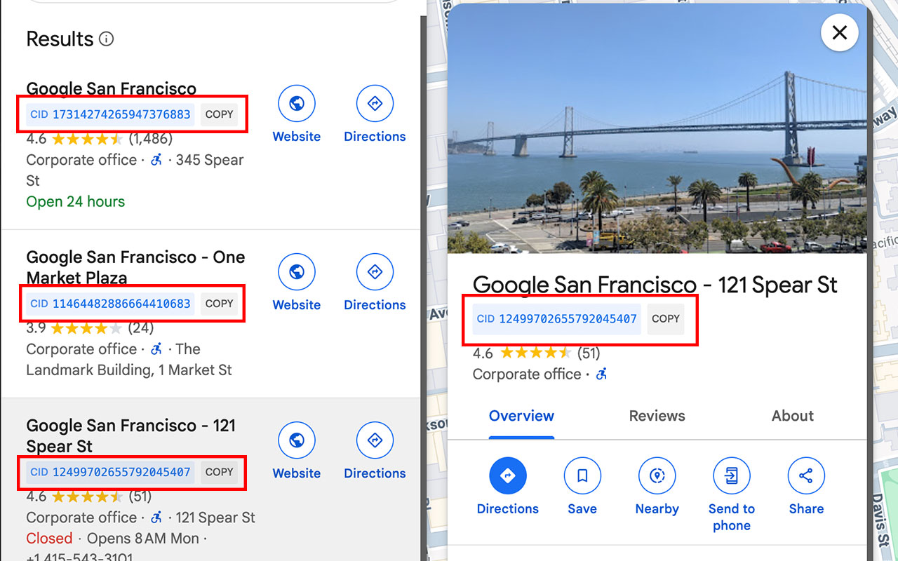

# Google Business Profile ID Extractor

A Chrome extension that automatically extracts and displays Google Business Profile IDs (formerly known as Google My Business IDs) from Google Search results and Google Maps pages. The extension helps you easily find and copy the unique identifier (CID) associated with any Google Business Profile listing.

## Features

- Automatically detects and displays Business Profile IDs from:
  - Google Search Knowledge Panels
  - Google Maps place URLs
  - Search results with business listings
  - Elements with `data-fid` attributes
  - Inline onclick handlers containing business data
  - XHR responses containing CID information

- Displays Business Profile IDs in a clean, modern interface under the business title
- One-click copy functionality for easy ID sharing
- Real-time monitoring of page changes to catch dynamically loaded content
- Automatic conversion of all ID formats (hexadecimal, prefixed hex) to standard decimal format
- Deduplication to prevent multiple displays of the same ID
- XMLHttpRequest monkey patching to capture IDs from dynamic data loading

## How It Works

The extension monitors Google Search results and Maps pages for elements containing Business Profile IDs in various formats:

1. Maps URLs format: `maps/place/...0x0:HEXVALUE...`
2. Data-FID format: `0xHEXVALUE1:0xHEXVALUE2`
3. XHR response data containing CID information

When a Business Profile ID is found, it:
1. Extracts the hexadecimal ID
2. Converts it to decimal format (standardizing all formats including `0x` prefixed hex values)
3. Displays it in a styled box under the business title
4. Provides a copy button for easy access

### XMLHttpRequest Monitoring

In some cases, Business Profile IDs are loaded dynamically through AJAX requests. To capture these:
- The extension monkey patches the XMLHttpRequest object
- Intercepts response data before it reaches the application
- Extracts any Business Profile IDs from the response
- Converts and displays them in the same format as other IDs

This ensures we catch Business Profile IDs that are:
- Loaded after initial page load
- Part of dynamic search results
- Included in JSON responses
- Added through infinite scrolling or pagination

## Installation

1. Clone this repository or download the source code
2. Open Chrome and navigate to `chrome://extensions/`
3. Enable "Developer mode" in the top right
4. Click "Load unpacked" and select the extension directory

## Usage

Simply browse Google Search results or Google Maps pages. The extension will automatically detect and display Business Profile IDs under the business titles. Click the "COPY" button next to any ID to copy it to your clipboard.

All Business Profile IDs are displayed in decimal format for consistency, regardless of their original format (hex, prefixed hex, etc.).

## Technical Details

The extension uses:
- MutationObserver to monitor DOM changes
- Regular expressions to extract Business Profile IDs from various formats
- XMLHttpRequest monkey patching for intercepting dynamic content
- BigInt for accurate conversion of large hexadecimal numbers
- Modern CSS for a clean, Google-like interface
- Standardized decimal format for all ID displays

## Screenshots

### Google Maps Integration

### Location Details

### Search Results

## Contributing

Feel free to submit issues and enhancement requests! 